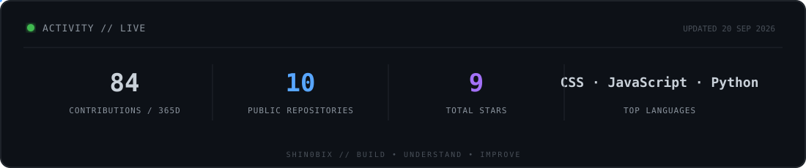

<div align="center">


</div>

<br/>

## 👋 About Me

I'm a developer who enjoys **building complete applications and understanding how they work under the hood**.

My projects explore **full-stack development, real-time communication, authentication, caching, and application architecture**. Alongside development, I'm actively learning **cybersecurity and penetration testing** to better understand how systems work—and how they can be secured.

```text
Build → Understand → Test → Improve
```

- 🔭 Building and deploying full-stack applications
- 🛡️ Learning cybersecurity through hands-on labs and practical environments
- 🌱 Exploring real-time systems, backend architecture, and application security
- 💡 Interested in technology from both the **builder's and security researcher's perspective**

---

## 🚀 Featured Projects

<table>
<tr>
<td width="100%" colspan="2">

### 🎥 Meetly <sub>● LIVE</sub>

**Real-time video communication platform built for seamless conversations.**

WebRTC-powered video and audio, WebSocket signaling, real-time chat, authentication, and persistent meeting rooms.

`FastAPI` · `WebRTC` · `WebSockets` · `SQLite`

🌐 [**Try Meetly →**](https://meetly.ujjawalcodes.site/) &nbsp;&nbsp; 💻 [**Source Code →**](https://github.com/shin0biX/Meetly)

</td>
</tr>

<tr>
<td width="50%" valign="top">

### 🔗 Shorty

**A modern URL shortener with security and analytics built in.**

Custom aliases, password-protected links, Redis caching, rate limiting, and detailed click analytics.

`FastAPI` · `React` · `Redis` · `SQLite`

🌐 [**Live Demo →**](https://shorty.ujjawalcodes.site/)  
💻 [**Source Code →**](https://github.com/shin0biX/Shorty)

</td>

<td width="50%" valign="top">

### 📦 StoriX

**A full-stack file storage and management platform.**

Secure file management, JWT authentication, sharing, subscription plans, and storage tracking.

`FastAPI` · `React` · `SQLAlchemy` · `SQLite`

🌐 [**Live Demo →**](https://files.ujjawalcodes.site/)  
💻 [**Source Code →**](https://github.com/shin0biX/StoriX)

</td>
</tr>
</table>

<div align="center">

<br/>

🧪 **Building more while learning.**  
[Explore all repositories →](https://github.com/shin0biX?tab=repositories)

</div>
<td width="50%" valign="top">

### 🧪 More Projects & Experiments

I also build smaller projects while learning and experimenting with:

- Python & backend development
- APIs and automation
- Frontend development
- Flask & FastAPI
- Security concepts and tooling

👉 **[Explore all repositories →](https://github.com/shin0biX?tab=repositories)**

</td>
</tr>
</table>

---

## 🧰 Tech I Work With

<div align="center">

**Languages**


<br/><br/>

**Development**


<br/><br/>

**Tools & Infrastructure**


</div>

---

## 🛡️ Currently Exploring

<table>
<tr>
<td width="50%" valign="top">

### 💻 Development

- Backend architecture
- Real-time applications
- APIs & authentication
- Deployment and infrastructure

</td>

<td width="50%" valign="top">

### 🔐 Cybersecurity

- Network & service enumeration
- Linux & Windows fundamentals
- Privilege escalation concepts
- Web application security

</td>
</tr>
</table>

> *Learning security helps me build with a better understanding of what can go wrong.*

---

## 📊 GitHub Activity

<div align="center">



</div>

---

## 🐍 Contribution Journey

<div align="center">


</div>

---

<div align="center">

### 💭 *Build. Break. Understand. Improve.*

Thanks for stopping by. Feel free to explore my projects and follow my journey.

</div>
